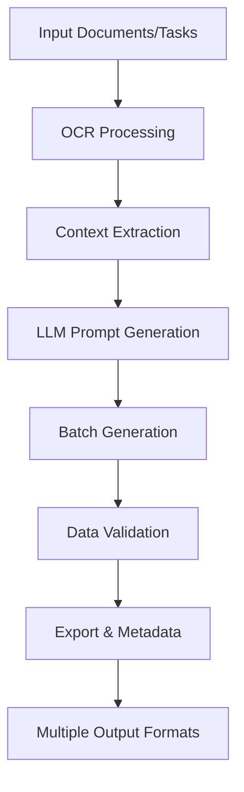

# 🔥 DekDataset

<div align="center">


</div>

---

<div align="center">
  <h2>🎯 Advanced AI Dataset Generator for Thai & Multilingual Applications</h2>
  <p><i>Professional-grade synthetic data generation with OCR, NLP, Vision & Multi-modal capabilities</i></p>
  
  <b>⚡ Fast • 🎯 Accurate • 🔧 Extensible • 📊 Production-Ready</b>
</div>

---

## 🌟 Overview

**DekDataset** is a comprehensive open-source framework for generating high-quality AI/ML datasets in Thai and multiple languages. Designed for both research and enterprise applications, it seamlessly integrates OCR document processing, NLP tasks, computer vision, and multi-modal data generation into a unified, scalable platform.

### 🎯 Key Differentiators

- 🔍 **Advanced OCR Integration**: Extract text from PDFs, images, and documents using Mistral OCR API
- 🧠 **AI-Powered Generation**: Leverage DeepSeek LLM for context-aware synthetic data creation  
- 🌏 **Thai Language Optimized**: Native support for Thai NLP tasks and cultural context
- 🏭 **Enterprise-Ready**: Robust error handling, batch processing, and production deployment features

---

## 📑 Table of Contents

- [🌟 Overview](#-overview)
- [✨ Features](#-features)  
- [⚡ Quick Start](#-quick-start)
- [🔍 OCR Document Processing](#-ocr-document-processing)
- [🛠️ How It Works](#️-how-it-works)
- [📁 Project Structure](#-project-structure)
- [🖼️ Example Use Cases](#️-example-use-cases)
- [🧑‍💻 Technical Details](#-technical-details)
- [🙏 Credits & License](#-credits--license)

---

## ✨ Features

### 🔧 Core Capabilities

- **🎯 Unified Task Schema**: Support for NLP, Vision, OCR, and Multi-modal tasks with centralized schema management
- **🤖 Automatic Prompting**: Generate optimized prompts for LLMs (DeepSeek, OpenAI, etc.) automatically
- **⚡ Batch Generation**: Advanced batch processing with error recovery, quota management, and intelligent retry mechanisms
- **📊 Data Validation & Metadata**: Complete validation, deduplication, enrichment, label balancing, and metadata export
- **💾 Flexible Output**: Export to JSONL, Parquet, Arrow, CSV formats compatible with HuggingFace, PyArrow, and Pandas

### 🔍 Advanced OCR & Document Processing

- **📄 PDF Processing**: Extract text from multi-page PDF documents using Poppler integration
- **🖼️ Image OCR**: Process JPG, PNG, JPEG images with high-accuracy text recognition
- **🌐 URL Support**: Direct processing of remote documents and images via URLs
- **🎯 Context-Aware Generation**: Use extracted OCR text as context for LLM-based dataset creation

### 🌐 Web Integration & Media

- **🔍 Web Scraping**: Download images from Bing, DuckDuckGo, Pexels, Pixabay with metadata
- **🎨 AI Image Generation**: Integrated support for AI-generated images and captions
- **📱 Multi-modal**: Combine text, images, and metadata for comprehensive datasets

### 🛡️ Enterprise Features

- **🔒 Robust & Reproducible**: Comprehensive error handling, logging, retry mechanisms, and fallback strategies
- **📈 Scalable Architecture**: Support for large-scale batch processing and distributed generation
- **🔧 Extensible Design**: Easy task/schema customization via `tasks.json` or REST API
- **📋 Production Monitoring**: Built-in monitoring, logging, and performance tracking

---

## ⚡ Quick Start

### 1. Installation & Setup

```bash
# Clone repository
git clone https://github.com/yourusername/DekDataset.git
cd DekDataset

# Install dependencies
pip install -r requirements.txt
```

### 2. Configure API Keys

Create a `.env` file in the project root:

```env
# Required: DeepSeek API for LLM generation
DEEPSEEK_API_KEY=your_deepseek_api_key

# Required: Mistral API for OCR processing
MISTRAL_API_KEY=your_mistral_api_key

# Optional: Image download services
PEXELS_API_KEY=your_pexels_api_key
PIXABAY_API_KEY=your_pixabay_api_key
```

### 3. Basic Dataset Generation

```bash
# Generate NLP dataset
python src/python/generate_dataset.py sentiment_analysis 100 --format jsonl

# Generate dataset from PDF document
python src/python/generate_dataset.py primary_school_knowledge 50 --input-file document.pdf

# Generate with custom settings
python src/python/generate_dataset.py medical_text_summarization 25 --delay 2 --format parquet
```

### 4. Advanced Usage

```bash
# Start task definitions API server
python src/python/task_definitions_api.py

# Export to different formats
python data/output/export_parquet_arrow.py data/output/dataset.jsonl parquet
```

---

## 🔍 OCR Document Processing

### Supported Formats

- **📄 PDF Documents**: Multi-page PDFs with automatic page-by-page processing
- **🖼️ Images**: JPG, PNG, JPEG files with high-accuracy text extraction
- **🌐 Remote Files**: Direct URL processing for online documents and images

### OCR Workflow Examples

#### Extract Text Only

```bash
# Extract from local PDF
python src/python/generate_dataset.py --input-file document.pdf

# Extract from image
python src/python/generate_dataset.py --input-file image.png

# Extract from URL
python src/python/generate_dataset.py --input-file https://example.com/document.pdf
```

#### Generate Dataset from Documents

```bash
# Create sentiment analysis dataset from PDF
python src/python/generate_dataset.py sentiment_analysis 20 --input-file textbook.pdf

# Generate medical dataset from research paper
python src/python/generate_dataset.py medical_text_summarization 15 --input-file research_paper.pdf

# Create Q&A dataset from educational content
python src/python/generate_dataset.py primary_school_knowledge 30 --input-file educational_material.png
```

### OCR Technical Features

- **🔧 Automatic Poppler Integration**: Built-in PDF processing without system dependencies
- **🎯 High-Accuracy Text Extraction**: Mistral OCR API with advanced text recognition
- **📊 Context-Aware Processing**: Extracted text feeds directly into LLM generation pipeline
- **⚡ Batch Document Processing**: Handle multiple documents and large files efficiently

---

## 🛠️ How It Works

### Generation Pipeline

1. **📋 Task Selection**: Choose from predefined tasks or create custom schemas
2. **🔍 Document Processing**: (Optional) Extract text from PDFs/images using OCR
3. **🤖 Prompt Generation**: Automatically generate optimized prompts for LLM
4. **⚡ Batch Generation**: Create synthetic data in intelligent batches with error recovery
5. **✅ Validation & Processing**: Validate, deduplicate, enrich, and balance generated data
6. **💾 Export & Metadata**: Export to multiple formats with comprehensive metadata

### Architecture Overview



---

## 📁 Project Structure

```text
DekDataset/
├── 📁 src/
│   ├── 🦀 main.rs, models.rs, api_client.rs, generator.rs, banner.rs
│   └── 🐍 python/
│       ├── generate_dataset.py      # Main generation script
│       ├── ocr_utils.py            # OCR processing module
│       ├── task_definitions.py     # Task schema management
│       └── task_definitions_api.py # REST API server
├── 📁 data/
│   ├── output/                     # Generated datasets
│   └── pdf/                        # Sample PDF documents
├── 📁 poppler-local/               # Portable PDF processing
├── 📁 docs/                        # Documentation
├── 📄 requirements.txt             # Python dependencies
└── 📄 README.md                    # This file
```

---

## 🖼️ Example Use Cases

### 1. Medical AI Dataset Creation

```bash
# Generate comprehensive medical benchmark dataset
python src/python/generate_dataset.py medical_benchmark 1000 --format jsonl --delay 1

# Create medical Q&A from research papers
python src/python/generate_dataset.py medical_text_summarization 200 --input-file medical_research.pdf
```

**Output**: High-quality medical datasets for training AI models, medical Q&A systems, or clinical decision support tools.

### 2. Educational Content Generation

```bash
# Thai primary school knowledge base
python src/python/generate_dataset.py primary_school_knowledge 500 --input-file thai_textbook.pdf

# Generate educational Q&A pairs
python src/python/generate_dataset.py qa_generation 300 --input-file educational_content.pdf
```

**Output**: Educational datasets for Thai language learning applications, automated tutoring systems, and knowledge assessment tools.

### 3. Thai NLP Model Training

```bash
# Sentiment analysis dataset in Thai
python src/python/generate_dataset.py sentiment_analysis 2000 --format parquet

# Text classification for Thai content
python src/python/generate_dataset.py text_classification 1500 --delay 2
```

**Output**: Large-scale Thai language datasets for training sentiment analysis, text classification, and other NLP models.

### 4. Document Processing Automation

```bash
# Process multiple PDF documents
python src/python/generate_dataset.py document_summarization 100 --input-file legal_documents.pdf

# Extract and analyze business reports
python src/python/generate_dataset.py business_analysis 75 --input-file quarterly_report.pdf
```

**Output**: Automated document analysis and summarization datasets for enterprise applications.

---

## 🧑‍💻 Technical Details

### Technology Stack

- **🐍 Python 3.10+**: Core processing and API integration
- **🦀 Rust Components**: High-performance data processing modules
- **🤖 DeepSeek API**: Advanced LLM for synthetic data generation
- **🔍 Mistral OCR**: State-of-the-art optical character recognition
- **📄 Poppler**: Robust PDF processing and conversion
- **⚡ FastAPI**: REST API for task management and automation

### Key Components

- **🔧 OCR Engine**: Mistral API integration with local Poppler support
- **📊 Data Pipeline**: Robust batch processing with error recovery
- **🎯 Task Management**: Flexible schema system with custom task support
- **💾 Export System**: Multi-format output with metadata preservation
- **🛡️ Error Handling**: Comprehensive logging and retry mechanisms

### Performance & Scalability

- **⚡ Batch Processing**: Intelligent batching for optimal API usage
- **🔄 Error Recovery**: Automatic retry with exponential backoff
- **📈 Scalable Architecture**: Support for distributed processing
- **📊 Monitoring**: Built-in performance tracking and logging

### Integration Capabilities

- **🤗 HuggingFace**: Direct compatibility with Datasets and Transformers
- **📊 PyArrow/Pandas**: Native support for data analysis workflows
- **☁️ Cloud Deployment**: Docker and cloud-ready architecture
- **🔌 API Integration**: RESTful API for external system integration

---

## 🙏 Credits & License

### Acknowledgments

- **🏢 DeepSeek**: Advanced LLM capabilities and API integration
- **🔍 Mistral AI**: High-quality OCR processing and text extraction
- **🤗 HuggingFace**: Ecosystem integration and dataset standards
- **📊 Apache Arrow**: High-performance data processing and storage
- **🌐 Open Source Community**: Various libraries and tools that make this project possible

### License & Usage

- **📄 License**: MIT License - see [LICENSE](LICENSE) for details
- **💼 Commercial Use**: Permitted under MIT license terms
- **🔧 Contributions**: Welcome via pull requests and issues
- **📞 Support**: Community support through GitHub issues

### Project Information

- **👨‍💻 Developed by**: ZOMBIT Team
- **🌐 Repository**: [github.com/JonusNattapong/DekDataset](https://github.com/JonusNattapong/DekDataset)
- **📧 Contact**: zombitx64@gmail.com
- **🎯 Version**: 2025.05 - Production Ready
- **🏷️ Tags**: AI, ML, Dataset, Thai NLP, OCR, Synthetic Data, DeepSeek, Python

---

<div align="center">

**⭐ Star this repository if you find it useful!**

[](https://github.com/JonusNattapong/DekDataset/stargazers)
[](https://github.com/JonusNattapong/DekDataset/network/members)
[](https://github.com/JonusNattapong/DekDataset/issues)

</div>
