<div align="center">

# 🚀 **DekDataset**
### *AI-Powered Thai Dataset Generator & Multi-Modal Data Platform*

[](https://www.python.org/)
[](https://fastapi.tiangolo.com/)
[](https://deepseek.com/)
[](https://ollama.ai/)

[](LICENSE)
[](https://github.com/zombitx64/DekDataset)
[](https://github.com/zombitx64/DekDataset)

---

*🎯 **Professional-grade synthetic dataset generator** for Thai & multilingual AI applications*  
*⚡ Modern web interface • 🤖 Multi-model support • 📊 Interactive previews • 🔧 Enterprise ready*

[**🎮 Live Demo**](http://localhost:8000) • [**📖 Documentation**](#-documentation) • [**🚀 Quick Start**](#-quick-start) • [**💬 Community**](https://github.com/zombitx64/DekDataset/discussions)

</div>

---

## 🌟 **What is DekDataset?**

**DekDataset** is a next-generation synthetic dataset generator that combines the power of modern AI models with an intuitive web interface. Built specifically for Thai language applications while supporting global use cases, it transforms dataset creation from a complex, time-consuming process into an elegant, streamlined experience.

<div align="center">

### ✨ **Key Highlights**

| 🎯 **Smart Generation** | 🌐 **Multi-Model Support** | 📊 **Interactive Preview** | 🔧 **Enterprise Ready** |
|:---:|:---:|:---:|:---:|
| AI-powered prompts<br/>Quality validation<br/>Batch processing | DeepSeek API<br/>Ollama Local<br/>Custom models | Real-time table view<br/>Data exploration<br/>Export controls | Production scaling<br/>Error handling<br/>Monitoring tools |

</div>

---

## 🎮 **Features Overview**

<table>
<tr>
<td width="50%">

### 🌐 **Modern Web Interface**
- **Interactive Dashboard**: Beautiful, responsive UI built with modern CSS
- **Real-time Generation**: Live progress tracking with abort controls
- **Preview Tables**: Expandable data views with filtering and search
- **Multi-format Export**: JSON Lines, CSV, ZIP with one-click download
- **Task Management**: Create, edit, and organize generation tasks
- **Quality Control**: Built-in validation and duplicate detection

</td>
<td width="50%">

### 🤖 **Multi-Model AI Support**
- **DeepSeek API**: Cloud-powered generation with latest models
- **Ollama Integration**: Local model support for privacy & speed
- **Model Auto-Detection**: Automatically discovers available models
- **Smart Switching**: Seamless switching between providers
- **Custom Prompts**: Advanced prompt engineering for quality
- **Batch Processing**: Intelligent batching for optimal performance

</td>
</tr>
<tr>
<td width="50%">

### 📊 **Data Excellence**
- **Quality Validation**: Automatic quality scoring and filtering
- **Schema Enforcement**: Strict adherence to defined data structures
- **Deduplication**: Advanced similarity detection and removal
- **Metadata Enrichment**: Comprehensive metadata for each entry
- **Format Support**: Multiple export formats for different use cases
- **Version Control**: Track and manage dataset versions

</td>
<td width="50%">

### 🔧 **Developer Experience**
- **RESTful API**: Complete API for programmatic access
- **Interactive Docs**: Auto-generated API documentation
- **Error Handling**: Robust error recovery and reporting
- **Monitoring**: Built-in performance and health monitoring
- **Extensible**: Easy to add custom tasks and models
- **Docker Ready**: Container support for easy deployment

</td>
</tr>
</table>

---

## 🚀 **Quick Start**

### **Option 1: Web Interface** *(Recommended)*

```bash
# 1️⃣ Clone the repository
git clone https://github.com/zombitx64/DekDataset.git
cd DekDataset

# 2️⃣ Install dependencies
pip install -r requirements.txt

# 3️⃣ Set up environment
echo "DEEPSEEK_API_KEY=your_api_key_here" > .env

# 4️⃣ Launch web interface
cd src/web
python app.py

# 5️⃣ Open browser → http://localhost:8000
```

### **Option 2: Command Line**

```bash
# Generate Thai sentiment analysis dataset
python src/python/generate_dataset.py sentiment_analysis 100 --output dataset.jsonl

# Generate with specific model
python src/web/app.py --generate --task qa_generation --count 50 --model deepseek-chat
```

### **Option 3: Docker** *(Coming Soon)*

```bash
docker run -p 8000:8000 -e DEEPSEEK_API_KEY=your_key zombit/dekdataset:latest
```

---

## 🎯 **Use Cases & Examples**

<div align="center">

### 🎭 **Popular Use Cases**

</div>

<table>
<tr>
<td width="33%">

### 🧠 **NLP & Text Analysis**
```python
# Sentiment Analysis
task: "thai_sentiment"
count: 1000
format: "jsonl"

# Text Classification  
task: "news_category"
count: 500
format: "csv"

# Question Answering
task: "thai_qa"
count: 250
format: "parquet"
```

</td>
<td width="33%">

### 📚 **Educational Content**
```python
# Thai Language Learning
task: "language_lessons"
count: 300
format: "jsonl"

# Math Problems
task: "primary_math"
count: 200
format: "csv"

# Science Q&A
task: "science_facts"
count: 150
format: "json"
```

</td>
<td width="33%">

### 🏥 **Domain-Specific**
```python
# Medical Dataset
task: "medical_diagnosis"
count: 400
format: "jsonl"

# Legal Documents
task: "legal_analysis"
count: 100
format: "csv"

# Financial Data
task: "market_sentiment"
count: 750
format: "parquet"
```

</td>
</tr>
</table>

---

## 📖 **Documentation**

<div align="center">

### 📚 **Complete Guides**

</div>

<table>
<tr>
<td width="25%">

#### 🎮 **User Guides**
- [Web Interface Tutorial](docs/web-interface.md)
- [Task Creation Guide](docs/task-creation.md)
- [Data Export Options](docs/export-formats.md)
- [Quality Control](docs/quality-control.md)

</td>
<td width="25%">

#### 🔧 **Developer Docs**
- [API Reference](docs/api-reference.md)
- [Custom Models](docs/custom-models.md)
- [Schema Design](docs/schema-design.md)
- [Deployment Guide](docs/deployment.md)

</td>
<td width="25%">

#### 🚀 **Advanced Topics**
- [Ollama Integration](docs/ollama-setup.md)
- [Performance Tuning](docs/performance.md)
- [Error Handling](docs/error-handling.md)
- [Monitoring Setup](docs/monitoring.md)

</td>
<td width="25%">

#### 🌐 **Community**
- [Contributing Guide](CONTRIBUTING.md)
- [Code of Conduct](CODE_OF_CONDUCT.md)
- [Issue Templates](docs/issue-templates.md)
- [Discussions](https://github.com/zombitx64/DekDataset/discussions)

</td>
</tr>
</table>

---

## 🛠️ **Architecture & Technology**

<div align="center">

### 🏗️ **System Architecture**

```mermaid
graph TB
    subgraph "🌐 Frontend Layer"
        A[Web Interface] --> B[Interactive Dashboard]
        B --> C[Real-time Preview]
        C --> D[Export Controls]
    end
    
    subgraph "⚡ API Layer"
        E[FastAPI Server] --> F[Task Management]
        F --> G[Generation Engine]
        G --> H[Quality Control]
    end
    
    subgraph "🤖 AI Models"
        I[DeepSeek API] --> J[Cloud Generation]
        K[Ollama Local] --> L[Local Generation]
        M[Custom Models] --> N[Extensible Support]
    end
    
    subgraph "💾 Data Layer"
        O[Dataset Cache] --> P[Export Engine]
        P --> Q[Multiple Formats]
        Q --> R[Metadata Store]
    end
    
    A --> E
    E --> I
    E --> K
    E --> M
    H --> O
```



</div>

### 🔧 **Technology Stack**

<table>
<tr>
<td width="25%">

#### **Frontend**
- Modern CSS3/HTML5
- Responsive Bootstrap
- Interactive JavaScript
- Real-time updates
- Progressive enhancement

</td>
<td width="25%">

#### **Backend**
- FastAPI (Python)
- Async/await patterns
- RESTful API design
- Auto-generated docs
- Error handling

</td>
<td width="25%">

#### **AI Integration**
- DeepSeek API client
- Ollama local support
- Custom model adapters
- Prompt optimization
- Quality validation

</td>
<td width="25%">

#### **Data Pipeline**
- JSON/CSV/Parquet
- Schema validation
- Batch processing
- Cache management
- Export flexibility

</td>
</tr>
</table>

---

## 🎨 **Screenshots & Demo**

<div align="center">

### 📸 **Visual Tour**

</div>

<table>
<tr>
<td width="50%">

#### 🏠 **Main Dashboard**

*Modern interface with task selection and model configuration*

#### 📊 **Data Preview**

*Interactive table with expandable content and export options*

</td>
<td width="50%">

#### 🎯 **Generation Progress**

*Real-time generation with progress tracking and quality metrics*

#### 📥 **Export Options**

*Multiple format downloads with comprehensive metadata*

</td>
</tr>
</table>

---

## 📈 **Performance & Scalability**

<div align="center">

### ⚡ **Performance Metrics**

</div>

<table>
<tr>
<td width="25%">

#### **🚀 Speed**
- **Generation**: 10-50 entries/min
- **Response Time**: <2s average
- **Batch Processing**: Up to 1000 entries
- **Export**: <5s for most formats

</td>
<td width="25%">

#### **🎯 Quality**
- **Validation**: 99%+ accuracy
- **Deduplication**: Advanced similarity
- **Schema Compliance**: 100%
- **Error Rate**: <1%

</td>
<td width="25%">

#### **📊 Capacity**
- **Concurrent Users**: 10+
- **Dataset Size**: Unlimited
- **Model Support**: 20+ models
- **Export Formats**: 5 formats

</td>
<td width="25%">

#### **🔧 Reliability**
- **Uptime**: 99.9%+
- **Error Recovery**: Automatic
- **Monitoring**: Built-in
- **Backup**: Version control

</td>
</tr>
</table>

---

## 🔧 **Installation & Setup**

### **🐍 Python Environment**

```bash
# Create virtual environment
python -m venv dekdataset-env
source dekdataset-env/bin/activate  # Linux/Mac
# dekdataset-env\Scripts\activate  # Windows

# Install dependencies
pip install -r requirements.txt
```

### **🔑 Environment Configuration**

```bash
# Create .env file
cat > .env << EOF
# Required: DeepSeek API for cloud generation
DEEPSEEK_API_KEY=sk-your-deepseek-api-key

# Optional: Mistral for document processing
MISTRAL_API_KEY=your-mistral-api-key

# Optional: Ollama server URL (default: localhost:11434)
OLLAMA_API_URL=http://localhost:11434
EOF
```

### **🚀 Local Model Setup (Ollama)**

```bash
# Install Ollama
curl -fsSL https://ollama.ai/install.sh | sh

# Pull popular models
ollama pull llama2
ollama pull qwen:7b
ollama pull codellama

# Start Ollama server
ollama serve
```

### **✅ Verification**

```bash
# Test web interface
cd src/web && python app.py
# → Open http://localhost:8000

# Test API
curl http://localhost:8000/api/status

# Test generation
python -c "from src.web.app import get_deepseek_api_key; print('✅ Setup complete!')"
```

---

## 🎯 **API Reference**

<div align="center">

### 📡 **REST API Endpoints**

</div>

<table>
<tr>
<td width="50%">

#### **🔧 Core Operations**
```http
GET    /api/tasks              # List all tasks
POST   /api/tasks              # Create new task
GET    /api/tasks/{id}         # Get specific task
DELETE /api/tasks/{id}         # Delete task

POST   /api/generate           # Generate dataset
POST   /api/test-generation    # Test generation
GET    /api/status             # System status
```

</td>
<td width="50%">

#### **📊 Data & Models**
```http
GET    /api/models/ollama      # Available Ollama models
GET    /api/models/all         # All available models
GET    /api/quality-config     # Quality settings
POST   /api/quality-config     # Update quality settings

GET    /api/download/{format}/{task_id}  # Download dataset
```

</td>
</tr>
</table>

### **📝 Example API Usage**

<details>
<summary><b>🔍 Click to see API examples</b></summary>

```python
import requests

# Generate dataset
response = requests.post('http://localhost:8000/api/generate', json={
    'task_id': 'sentiment_analysis',
    'count': 100,
    'model': 'deepseek-chat'
})

# Get available models
models = requests.get('http://localhost:8000/api/models/all').json()

# Download dataset
dataset = requests.get('http://localhost:8000/api/download/json/sentiment_analysis')
```

</details>

---

## 🌍 **Community & Support**

<div align="center">

### 🤝 **Join Our Community**

[](https://discord.gg/dekdataset)
[](https://github.com/zombitx64/DekDataset/discussions)
[](https://twitter.com/zombitx64)

</div>

<table>
<tr>
<td width="25%">

#### 💬 **Get Help**
- [GitHub Issues](https://github.com/zombitx64/DekDataset/issues)
- [Discussions](https://github.com/zombitx64/DekDataset/discussions)
- [Discord Community](https://discord.gg/dekdataset)
- [Email Support](mailto:zombitx64@gmail.com)

</td>
<td width="25%">

#### 🤝 **Contribute**
- [Contributing Guide](CONTRIBUTING.md)
- [Developer Setup](docs/development.md)
- [Code Style](docs/code-style.md)
- [Pull Requests](https://github.com/zombitx64/DekDataset/pulls)

</td>
<td width="25%">

#### 📢 **Stay Updated**
- [Release Notes](CHANGELOG.md)
- [Roadmap](docs/roadmap.md)
- [Blog](https://blog.dekdataset.com)
- [Newsletter](https://newsletter.dekdataset.com)

</td>
<td width="25%">

#### 🏆 **Recognition**
- [Hall of Fame](docs/contributors.md)
- [Showcase](docs/showcase.md)
- [Case Studies](docs/case-studies.md)
- [Awards](docs/awards.md)

</td>
</tr>
</table>

---

## 🗺️ **Roadmap**

<div align="center">

### 🚀 **What's Coming Next**

</div>

<table>
<tr>
<td width="25%">

#### **🎯 Q1 2025**
- [ ] Docker deployment
- [ ] Batch task processing
- [ ] Advanced filtering
- [ ] User authentication
- [ ] API rate limiting

</td>
<td width="25%">

#### **⚡ Q2 2025**
- [ ] Multi-language support
- [ ] Custom model training
- [ ] Advanced analytics
- [ ] Workflow automation
- [ ] Cloud deployment

</td>
<td width="25%">

#### **🌟 Q3 2025**
- [ ] Enterprise features
- [ ] Team collaboration
- [ ] Advanced monitoring
- [ ] Custom plugins
- [ ] Mobile app

</td>
<td width="25%">

#### **🚀 Future**
- [ ] AI-powered optimization
- [ ] Federated learning
- [ ] Blockchain integration
- [ ] Real-time streaming
- [ ] Global distribution

</td>
</tr>
</table>

---

## 🏆 **Contributors & Acknowledgments**

<div align="center">

### 👨‍💻 **Core Team**

<table>
<tr>
<td align="center">
<br>
<sub><b>ZOMBIT</b></sub><br>
<sub>Project Lead & Architecture</sub>
</td>
<td align="center">
<br>
<sub><b>JonusNattapong</b></sub><br>
<sub>Core Development & AI Integration</sub>
</td>
</tr>
</table>

### 🙏 **Special Thanks**

</div>

- **🤖 DeepSeek**: For providing powerful AI models and API access
- **🦙 Ollama**: For enabling local model deployment and inference
- **🚀 FastAPI**: For the excellent web framework and auto-documentation
- **🎨 Bootstrap**: For responsive UI components and styling
- **🌟 Open Source Community**: For countless libraries and contributions

---

## 📄 **License & Legal**

<div align="center">

### ⚖️ **Licensing Information**

</div>

<table>
<tr>
<td width="25%">

#### **📜 MIT License**
- ✅ Commercial use
- ✅ Modification
- ✅ Distribution  
- ✅ Private use

</td>
<td width="25%">

#### **🔒 Privacy**
- No data collection
- Local processing option
- User data ownership
- GDPR compliant

</td>
<td width="25%">

#### **🛡️ Security**
- Regular updates
- Security patches
- Vulnerability reports
- Best practices

</td>
<td width="25%">

#### **📞 Contact**
- **Email**: zombitx64@gmail.com
- **GitHub**: @zombitx64
- **Project**: DekDataset
- **Version**: 2025.05

</td>
</tr>
</table>

---

<div align="center">

## ⭐ **Star History**

[](https://star-history.com/#zombitx64/DekDataset&Date)

### 🎉 **Thank you for being part of the DekDataset community!**

[](https://github.com/zombitx64/DekDataset)

**[⬆️ Back to Top](#-dekdataset)**

</div>
